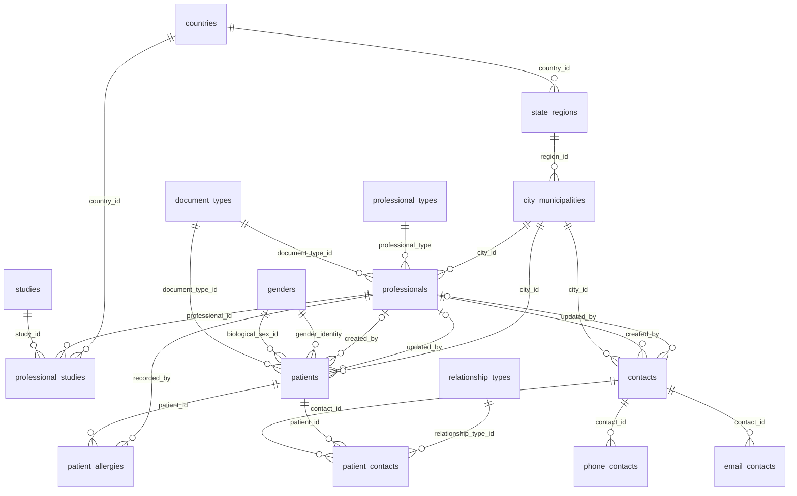
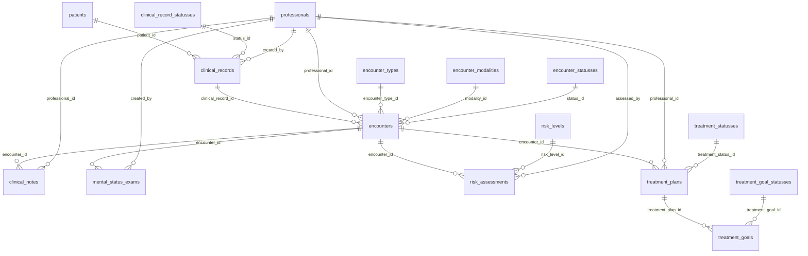
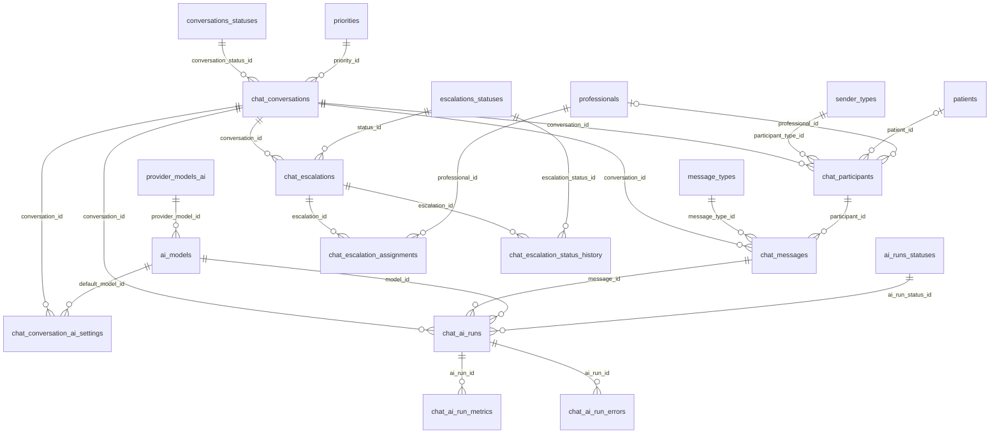

# 🧠 MindConnect: estructura de tablas con Flyway

Base de datos **PostgreSQL** de **MindConnect**, una plataforma de salud mental que integra pacientes, profesionales, historia clínica y chat asistido por IA. Son **52 tablas** creadas automáticamente con **migraciones Flyway** dentro de un proyecto **Spring Boot multi-módulo** con **arquitectura hexagonal**.

> Cuando arranca la aplicación, Flyway revisa qué scripts `.sql` faltan por ejecutar y los aplica en orden. No tienes que crear ninguna tabla a mano.

---

## 📋 Tabla de contenido

- [Tecnologías](#-tecnologías)
- [Arquitectura](#-arquitectura-hexagonal)
- [Estructura del proyecto](#-estructura-del-proyecto)
- [Modelo de datos](#-modelo-de-datos)
- [Requisitos](#-requisitos)
- [Configuración y ejecución](#-configuración-y-ejecución)
- [Verificar las migraciones](#-verificar-las-migraciones)
- [Listado de migraciones](#-listado-de-migraciones)
- [Convenciones](#-convenciones)
- [Estado del proyecto](#-estado-del-proyecto)

---

## 🛠 Tecnologías

| Tecnología | Versión | Uso |
|---|---|---|
| Java | 25 | Lenguaje |
| Spring Boot | 4.0.2 | Framework |
| Spring Data JPA / Hibernate | (BOM de Boot) | Persistencia |
| Flyway | (BOM de Boot) | Versionado de la base de datos |
| PostgreSQL | 13 o superior | Motor de base de datos (usa `gen_random_uuid()`) |
| Maven | 3.9+ | Build multi-módulo |

---

## 🏛 Arquitectura hexagonal

El proyecto se divide en tres módulos Maven. Las dependencias **siempre apuntan hacia el centro**:

```
infrastructure  ──►  application  ──►  domain
 (Spring, JPA,        (casos de uso,     (modelo de negocio,
  Flyway, REST)        puertos in/out)    Java puro)
```

| Módulo | Responsabilidad | ¿Conoce Spring? |
|---|---|---|
| `domain` | Modelos y reglas de negocio | ❌ No |
| `application` | Casos de uso y puertos (interfaces) | ❌ No |
| `infrastructure` | Adaptadores: base de datos, API REST, configuración y **migraciones** | ✅ Sí |

🧩 **Analogía:** el `domain` es el motor de un carro, el `application` es el tablero de control y `infrastructure` son las llantas y el tanque. Puedes cambiar las llantas (por ejemplo, pasar de PostgreSQL a MySQL) sin tocar el motor.

---

## 📁 Estructura del proyecto

```
practica_tablas52/
├── pom.xml                          # POM padre (BOM de Spring Boot)
├── domain/
│   └── pom.xml
├── application/
│   └── pom.xml
└── infrastructure/
    ├── pom.xml                      # web, JPA, validation, PostgreSQL, Flyway
    └── src/main/
        ├── java/com/practica_tablas/infrastructure/
        │   └── PracticaTablasApplication.java
        └── resources/
            ├── application.yml      # perfil activo: dev
            ├── application-dev.yml  # datasource + Flyway
            ├── application-prod.yml
            └── db/migration/        # 52 scripts V1 … V52
```

---

## 🗂 Modelo de datos

**52 tablas, 68 llaves foráneas y 68 índices**, organizados en estos módulos:

| Módulo | Tablas |
|---|---|
| 🌎 Ubicación | `countries`, `state_regions`, `city_municipalities` |
| 📚 Catálogos | `document_types`, `genders`, `relationship_types`, `professional_types`, `studies`, `medication_routes`, `assessment_types`, `consent_types`, `diagnostic_systems` |
| 👩‍⚕️ Profesionales | `professionals`, `professional_studies` |
| 🧑 Pacientes y contactos | `patients`, `patient_allergies`, `contacts`, `phone_contacts`, `email_contacts`, `patient_contacts` |
| 🩺 Historia clínica | `clinical_records`, `encounters`, `clinical_notes`, `mental_status_exams`, `risk_assessments`, `treatment_plans`, `treatment_goals` y sus catálogos de estados, tipos y niveles |
| 💬 Chat | `chat_conversations`, `chat_participants`, `chat_messages`, `chat_escalations`, `chat_escalation_assignments`, `chat_escalation_status_history` y sus catálogos |
| 🤖 IA | `provider_models_ai`, `ai_models`, `chat_conversation_ai_settings`, `chat_ai_runs`, `chat_ai_run_metrics`, `chat_ai_run_errors`, `ai_runs_statuses` |

<details>
<summary><b>🌎 Diagrama: ubicación, catálogos, profesionales, pacientes y contactos</b></summary>


</details>

<details>
<summary><b>🩺 Diagrama: historia clínica</b></summary>


</details>

<details>
<summary><b>💬 Diagrama: chat e inteligencia artificial</b></summary>


</details>

> Cómo leer los diagramas: `||--o{` significa "uno a muchos" (por ejemplo, un país tiene muchas regiones). `|o--o{` indica que la FK es opcional (acepta `NULL`).

---

## ✅ Requisitos

- **JDK 25**
- **Maven 3.9+**
- **PostgreSQL 13+** corriendo en `localhost:5432`
- Git

---

## 🚀 Configuración y ejecución

### 1. Clonar el repositorio

```bash
git clone https://github.com/manuelisaaccamanidiaz-lgtm/estructura-de-tablas-usando-flayway.git
cd estructura-de-tablas-usando-flayway
```

### 2. Crear la base de datos

```sql
CREATE DATABASE database;
```

> El esquema `database` **no** se crea a mano: Flyway lo crea solo gracias a `create-schemas: true`.

### 3. Configurar las credenciales

En `infrastructure/src/main/resources/application-dev.yml`:

```yaml
spring:
  datasource:
    url: jdbc:postgresql://localhost:5432/database
    username: ${DB_USER:postgres}
    password: ${DB_PASSWORD:postgres}
```

> 🔐 Usa variables de entorno en lugar de escribir la contraseña en el archivo, sobre todo si el repositorio es público.

### 4. Compilar y ejecutar

```bash
mvn clean install
mvn -pl infrastructure spring-boot:run
```

La API queda en **http://localhost:8081**. Al arrancar, la consola debe mostrar algo como:

```
Successfully applied 52 migrations to schema "database", now at version v52
```

---

## 🔍 Verificar las migraciones

```sql
-- Historial de Flyway
SELECT version, description, success
FROM database.flyway_schema_history_database
ORDER BY installed_rank;

-- Cantidad de tablas creadas (debe dar 52, más la tabla del historial)
SELECT COUNT(*)
FROM information_schema.tables
WHERE table_schema = 'database';
```

---

## 📜 Listado de migraciones

El orden respeta las dependencias: una tabla se crea **después** de las tablas a las que apunta su FK.

<details>
<summary><b>Ver las 52 migraciones</b></summary>

| Versión | Tabla | Módulo | Depende de |
|---|---|---|---|
| V1 | `countries` | Ubicación | — |
| V2 | `state_regions` | Ubicación | `countries` |
| V3 | `city_municipalities` | Ubicación | `state_regions` |
| V4 | `document_types` | Catálogos generales | — |
| V5 | `genders` | Catálogos generales | — |
| V6 | `relationship_types` | Catálogos generales | — |
| V7 | `professional_types` | Catálogos generales | — |
| V8 | `studies` | Catálogos generales | — |
| V9 | `medication_routes` | Catálogos generales | — |
| V10 | `assessment_types` | Catálogos generales | — |
| V11 | `consent_types` | Catálogos generales | — |
| V12 | `diagnostic_systems` | Catálogos generales | — |
| V13 | `professionals` | Profesionales | `city_municipalities`, `document_types`, `professional_types` |
| V14 | `professional_studies` | Profesionales | `countries`, `professionals`, `studies` |
| V15 | `patients` | Pacientes | `city_municipalities`, `document_types`, `genders`, `professionals` |
| V16 | `patient_allergies` | Pacientes | `patients`, `professionals` |
| V17 | `contacts` | Contactos | `city_municipalities`, `professionals` |
| V18 | `phone_contacts` | Contactos | `contacts` |
| V19 | `email_contacts` | Contactos | `contacts` |
| V20 | `patient_contacts` | Contactos | `contacts`, `patients`, `relationship_types` |
| V21 | `clinical_record_statusses` | Historia clínica | — |
| V22 | `encounter_types` | Historia clínica | — |
| V23 | `encounter_modalities` | Historia clínica | — |
| V24 | `encounter_statusses` | Historia clínica | — |
| V25 | `risk_levels` | Historia clínica | — |
| V26 | `treatment_statusses` | Historia clínica | — |
| V27 | `treatment_goal_statusses` | Historia clínica | — |
| V28 | `clinical_records` | Historia clínica | `clinical_record_statusses`, `patients`, `professionals` |
| V29 | `encounters` | Historia clínica | `clinical_records`, `encounter_modalities`, `encounter_statusses`, `encounter_types`, `professionals` |
| V30 | `clinical_notes` | Historia clínica | `encounters`, `professionals` |
| V31 | `mental_status_exams` | Historia clínica | `encounters`, `professionals` |
| V32 | `risk_assessments` | Historia clínica | `encounters`, `professionals`, `risk_levels` |
| V33 | `treatment_plans` | Historia clínica | `encounters`, `professionals`, `treatment_statusses` |
| V34 | `treatment_goals` | Historia clínica | `treatment_goal_statusses`, `treatment_plans` |
| V35 | `sender_types` | Chat | — |
| V36 | `priorities` | Chat | — |
| V37 | `conversations_statuses` | Chat | — |
| V38 | `message_types` | Chat | — |
| V39 | `ai_runs_statuses` | Chat | — |
| V40 | `escalations_statuses` | Chat | — |
| V41 | `provider_models_ai` | Inteligencia artificial | — |
| V42 | `ai_models` | Inteligencia artificial | `provider_models_ai` |
| V43 | `chat_conversations` | Chat | `conversations_statuses`, `priorities` |
| V44 | `chat_participants` | Chat | `chat_conversations`, `patients`, `professionals`, `sender_types` |
| V45 | `chat_messages` | Chat | `chat_conversations`, `chat_participants`, `message_types` |
| V46 | `chat_conversation_ai_settings` | Inteligencia artificial | `ai_models`, `chat_conversations` |
| V47 | `chat_ai_runs` | Inteligencia artificial | `ai_models`, `ai_runs_statuses`, `chat_conversations`, `chat_messages` |
| V48 | `chat_ai_run_metrics` | Inteligencia artificial | `chat_ai_runs` |
| V49 | `chat_ai_run_errors` | Inteligencia artificial | `chat_ai_runs` |
| V50 | `chat_escalations` | Chat | `chat_conversations`, `escalations_statuses` |
| V51 | `chat_escalation_assignments` | Chat | `chat_escalations`, `professionals` |
| V52 | `chat_escalation_status_history` | Chat | `chat_escalations`, `escalations_statuses` |

</details>

---

## 📐 Convenciones

| Elemento | Convención | Ejemplo |
|---|---|---|
| Archivo de migración | `V<n>__create_table_<tabla>.sql` | `V15__create_table_patients.sql` |
| Llave primaria | `id UUID DEFAULT gen_random_uuid()` | — |
| Llave foránea | `fk_<tabla>_<columna>` | `fk_patients_city_id` |
| Restricción única | `uq_<tabla>_<columna>` | `uq_patients_email` |
| Índice | `idx_<tabla>_<columna>` | `idx_encounters_status_id` |
| Auditoría | `created_at` / `updated_at` con `DEFAULT CURRENT_TIMESTAMP` | — |

### ⚠️ Regla de oro de Flyway

**Nunca edites una migración que ya se ejecutó.** Flyway guarda un *checksum* (una huella) de cada archivo y, si el archivo cambia, la aplicación no arranca. Cualquier cambio va en un archivo **nuevo**:

```
V53__add_column_nickname_to_patients.sql
```

🧩 **Analogía:** las migraciones son como un acta notarial. Lo firmado no se borra; se agrega una nueva acta que lo corrige.

---

## 📌 Estado del proyecto

- [x] Estructura multi-módulo hexagonal (`domain`, `application`, `infrastructure`)
- [x] 52 migraciones Flyway con PK, FK, UNIQUE e índices
- [ ] Corregir `application/pom.xml`: la dependencia `domain` usa `1.0.0-SNAPSHOT` y debe ser `${project.version}`
- [ ] Definir `<java.version>25</java.version>` en el `pom.xml` padre
- [ ] `application-dev.yml`: agregar un espacio en `init-sqls` (`- CREATE SCHEMA ...`)
- [ ] Modelos de dominio y puertos (`domain` / `application`)
- [ ] Entidades JPA, adaptadores y controladores REST (`infrastructure`)
- [ ] Configurar `application-prod.yml`

---

## 👤 Autor

**Manuel Isaac Camaño Díaz**

[](https://github.com/manuelisaaccamanidiaz-lgtm)
